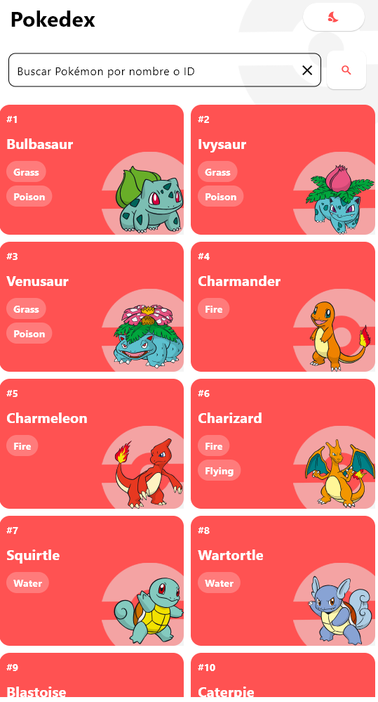
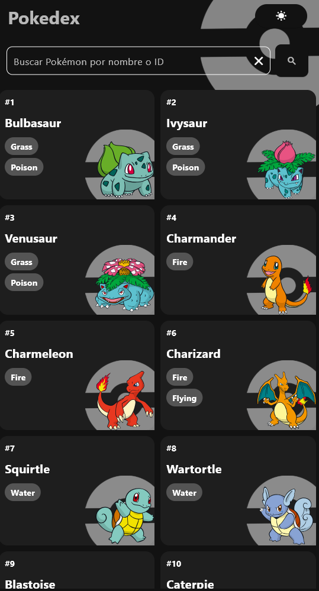
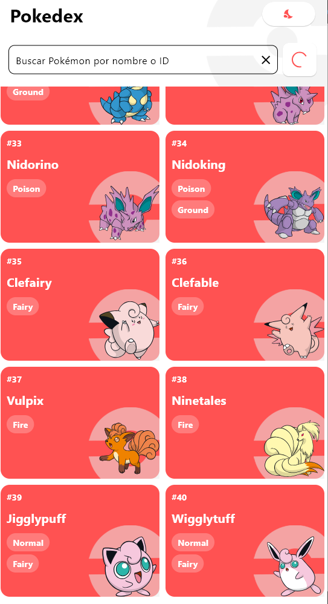
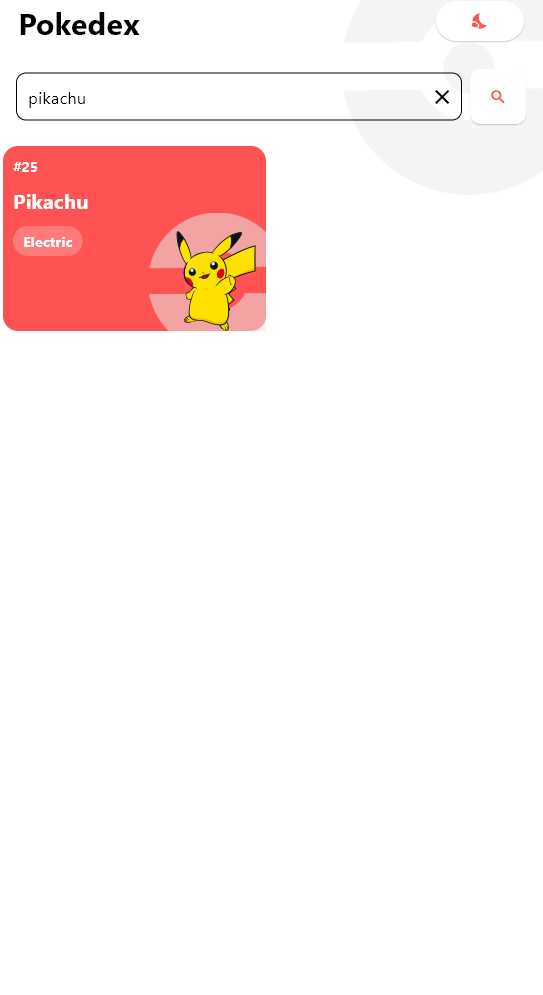
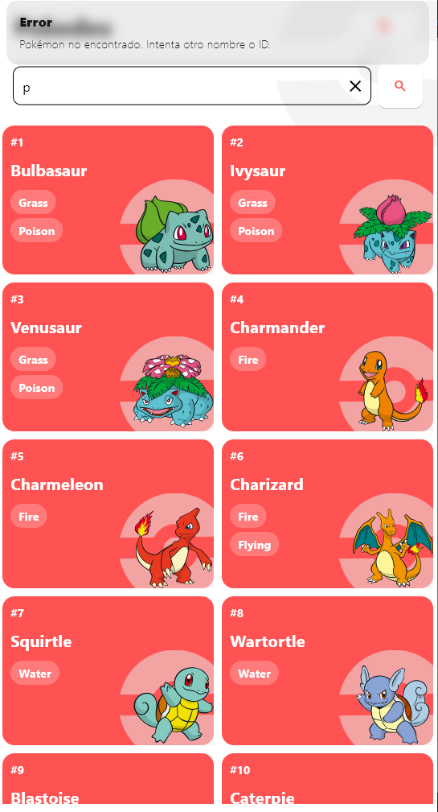
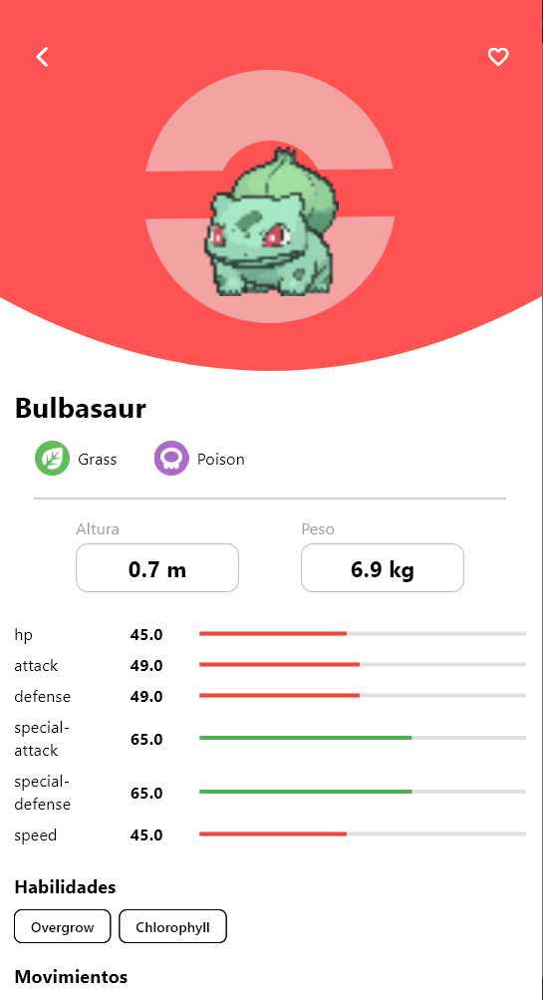
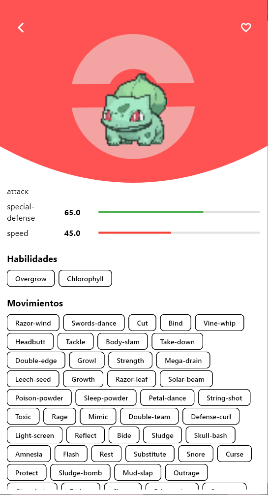

# Pokedex

## Dev

**Compilar y ejecutar proyecto**
* Instalaciones previas
  * Tener instalado **Flutter**
  * Tener instalado **Dart**
  * Tener instalado **VSCode**
  * Tener instalado **Android Studio** (opcional, para emulador)
* Tener un emulador o un dispositivo fisico conectado
* Presionar **F5** o correr el comando `flutter run` en la terminal
  * Seleccionar el dispositivo en caso de tener varios
* Esperar a que se compile y se instale la app en el dispositivo

## Paquetes usados
* get: ^4.7.2
  * Manejo de estados y rutas
* dio: ^5.9.0
  * Manejo de peticiones HTTP
* flutter_svg: ^2.2.0 
  * Manejo de imagenes SVG
* get_storage: ^2.1.1
  * Almacenamiento local simple y eficiente 

## Imagenes

**Principal**

  
  

**Scroll Infinito**

  

**Búsqueda**

  
  

**Detalle**

  
  

## Justificación 

**Por qué elecciones de paquetes**
* `get`: 
  * Para el manejo de estados y rutas de manera sencilla y eficiente.
  * Me siento cómodo usándolo y me permite desarrollar más rápido.
  * Cuenta con funcionalidades ya integradas que facilitan el desarrollo.
* `dio`: 
  * Para el manejo de peticiones HTTP, permitiendo un control más fino sobre las mismas.
  * Lo escogi por que lo he usado en otros proyectos recientes por lo que me resulta familiar.
* `flutter_svg`: 
  * Para el manejo de imágenes SVG, facilitando la inclusión de gráficos escalables.
  * Es el unico paquete `svg` que he usado en Flutter y me ha funcionado bien.
* `get_storage`: 
  * Para el almacenamiento local simple y eficiente.
  * Lo escogi por su simplicidad y facilidad de uso para almacenar datos pequeños como favoritos.

***

**Diseño de la aplicación**
* Revisar la carpeta `doc` incluida en el proyecto para ver la referencia de diseño de la aplicación.

***

**Si tuviera más tiempo**
* Realizaría pruebas unitarias y de widget
* Mejoraría la arquitectura
  * Implementaría mejor **clean architecture**
  * Crearía más capas (domain, application, etc)
* Me apegaría más a los principios **solid**
  * Separando lógica, clases y/o funcionalidades adecuadamente
  * Crearía más servicios o controladores de ser necesario
  * Separaría mejor las responsabilidades
* Revisaría las secciones donde pueda usar otros **patrones de diseño**
* Mejoraría la UI
  * Implementaría soporte para **modos oscuros y claros** de manera más completa.
* Revisaria como **se ve en diferentes dispositivos** y tamaños de pantalla
  * Me aseguraría que la **aplicación sea responsiva** y se vea bien en todas las plataformas.

***

## Roadmap de 7 Semanas: 
**Desarrollo de App Pokédex con Flutter**

### Semana 1: Configuración y Arquitectura Base

Objetivo: Establecer una base de proyecto sólida y escalable.

**Tareas**

Inicialización del Proyecto:
* Crear un nuevo proyecto Flutter.
* Configurar `analysis_options.yaml` para habilitar `null-safety` estricto y reglas de linter (ej. flutter_lints).

Definición de la Arquitectura:
* Elegir y estructurar el proyecto
* Crear la estructura de carpetas (`/data`, `/domain`, `/presentation`.)

Paquetes Clave:
* Seleccionar e integrar un gestor de estado (
  * ej. Riverpod por su seguridad en tiempo de compilación y flexibilidad
  * o GetX por su simplicidad y rapidez de desarrollo).
  * Configurar los Providers iniciales que la app necesitará.
* Añadir paquetes para HTTP (Dio), 
* Almacenamiento local (Hive o GetStorage)
* Navegación (GoRouter o GetX).

Capa de Datos Inicial:
* Configurar un cliente HTTP
* Crear el servicio para conectar con PokéAPI.
* Definir los modelos de datos iniciales (ej. Pokemon, PokemonListResponse).

UI Shell y Navegación:
* Crear la estructura básica de la UI (un Scaffold principal).
* Configurar un sistema de navegación.
* Implementar un interruptor para cambiar entre tema claro y oscuro.

### Semana 2: Listado de Pokémon y Paginación

Objetivo: Mostrar la lista principal de Pokémon con scroll infinito.

**Tareas**

UI del Listado:
* Crear la vista principal que mostrará una cuadrícula (GridView) o lista (ListView) de Pokémon.
* Diseñar y construir el widget de cada item (ej. una Card con el sprite y nombre del Pokémon).

Lógica de Paginación:
* Conectar la UI con el gestor de estado para solicitar la primera página de Pokémon (limit y offset).
* Implementar el scroll infinito: detectar el final de la lista para cargar la página siguiente y añadirla al estado.

Manejo de Estados de UI:
* Añadir un CircularProgressIndicator para la carga inicial.
* Mostrar un indicador de carga más pequeño al final de la lista al cargar nuevas páginas.
* Implementar un widget para mostrar mensajes de error si la llamada a la API falla.

### Semana 3: Vista de Detalle del Pokémon**

Objetivo: Visualizar toda la información relevante de un Pokémon seleccionado.

**Tareas**

Navegación al Detalle:
* Al tocar un Pokémon en la lista, navegar a la pantalla de detalle.
* Obtención de Datos Detallados:
  * Realizar las llamadas a los endpoints /pokemon/{id} y /pokemon-species/{id}.

UI de la Vista de Detalle:
* Sección Principal: Mostrar sprites, nombre, ID y tipos.
* Stats: Crear barras de estadísticas visuales para representar los base_stats.
* Habilidades: Listar las habilidades del Pokémon.
* Flavor Text: Mostrar una de las descripciones (flavor_text_entries).

Refinamiento Visual:
* Usar colores dinámicos en la UI basados en el tipo principal del Pokémon.

### Semana 4: Funcionalidades de Búsqueda y Filtro

Objetivo: Permitir al usuario encontrar Pokémon específicos por nombre/ID o por tipo.

**Tareas**

Implementación de la Búsqueda:
* Añadir un TextField en la UI del listado para la búsqueda.
* Implementar un debounce.
* Al buscar, llamar al endpoint /pokemon/{id|name} y mostrar el resultado (o un mensaje de "no encontrado").

Implementación del Filtro por Tipo:
* Añadir un `DropdownButton` o un conjunto de `FilterChip` para seleccionar un tipo.
* Al seleccionar un tipo, llamar al endpoint `/type/{id}` y mostrar la lista de Pokémon correspondientes.
* Asegurarse de que el filtro y la búsqueda se pueden reiniciar para volver al listado paginado.

### Semana 5: Cadena de Evolución y Favoritos

Objetivo: Mostrar la línea evolutiva y permitir guardar Pokémon favoritos con persistencia local.

**Tareas**

Cadena de Evolución:
* Desde la `data de species`, obtener la URL de `evolution_chain` y realizar la petición.
* Parsear la respuesta anidada de la cadena de evolución para obtener una lista lineal de los Pokémon.
* Crear un widget simple en la vista de detalle para mostrar la cadena (ej. Sprite1 -> Sprite2 -> Sprite3).

Persistencia Local:
* Integrar una solución de almacenamiento local.
* Crear un "repositorio" o servicio para gestionar los datos locales.

Lógica de Favoritos:
* Añadir un botón (ej. un IconButton con un ícono de estrella) en la vista de detalle.
* Implementar la lógica para añadir/quitar el ID del Pokémon de la base de datos local.
* Asegurarse de que el estado del botón refleje si el Pokémon es favorito.

### Semana 6: Pruebas, Caché y Refinamiento

Objetivo: Asegurar la calidad del código, mejorar el rendimiento y pulir la experiencia de usuario.

**Tareas**

Pruebas Unitarias (unit tests):
* Escribir las pruebas unitarias y de widgets necesarias

Implementación de Caché Básico:
* Añadir una capa de caché para las respuestas de la API.

Pulido de la UI/UX:
* Añadir placeholders (FadeInImage) para las imágenes mientras cargan.
* Revisar y mejorar todos los estados de carga y mensajes de error para que sean consistentes.
* Corregir todos los warnings del linter.

### Semana 7: Extras, Documentación y Entrega

Objetivo: Añadir funcionalidades opcionales y preparar el proyecto para su presentación.

**Tareas**

Funcionalidades Extra (Opcional):
* Tabla de Efectividades: En la vista de detalle, añadir una tabla simple que muestre las debilidades y fortalezas del tipo del Pokémon.
* Soporte Offline: Usar el caché para mostrar los últimos datos vistos cuando no hay conexión.

Documentación README.md:
* Escribir un README.md completo que incluya:
  * Descripción del proyecto.
  * Instrucciones para clonar, instalar dependencias y ejecutar la app.
  * Limitaciones conocidas.

Preparación Final:
* Crear capturas de pantalla o un GIF mostrando las funcionalidades principales de la app.
* Preparar documentación adicional si es necesario.
* Limpiar el historial de Git, crear un commit final y subir el repositorio a una plataforma como GitHub.